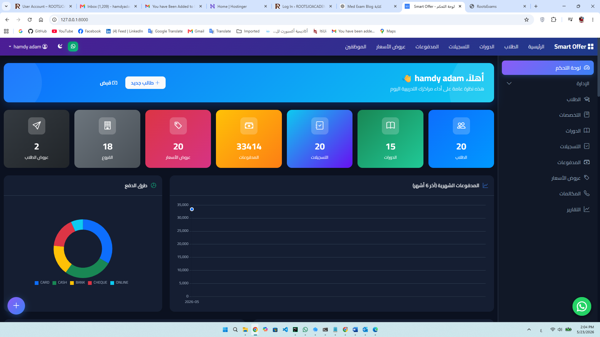

# دليل استخدام نظام Smart Offer

> دليل شامل ومبسط لفهم آلية عمل النظام وكيفية استخدامه لإدارة المعاهد والمراكز التدريبية.

---

## 1. نظرة عامة على النظام

**Smart Offer** هو نظام متكامل لإدارة المعاهد والمراكز التدريبية، بيتيح لك إدارة:
- الطلاب والمتدربين
- الدورات والتخصصات
- التسجيلات والحجوزات
- المدفوعات وسندات القبض والصرف
- عروض الأسعار للعملاء
- الحملات التسويقية (عروض الطلاب)
- المكالمات والمتابعات
- التقارير والإحصائيات

النظام بيشتغل على **Django (Backend)** وبيستخدم قاعدة بيانات SQLite (في التطوير) أو PostgreSQL (في الإنتاج).

---

## 2. الهيكل التنظيمي للبيانات

قبل ما تستخدم النظام، لازم تفهم التسلسل الهرمي للبيانات:

```
الشركة (Company)
  └── الفرع (Branch)
        ├── التخصص/الدبلوم (Master)
        │     └── الدورة/الفصل (Course)
        ├── البنوك (Bank)
        ├── تصنيفات التخصصات (MasterCategory)
        └── فِرق العمل (Team)
              └── الموظفين (Person)
                    └── الأدوار والصلاحيات (Role + Permission)
```

### الشركة (Company)
- هي الكيان التجاري الرئيسي (مثلاً: معهد XYZ).
- بياناتها: اسم الشركة، العنوان، التليفونات، السجل التجاري، الرقم الضريبي، الشعار.

### الفرع (Branch)
- كل شركة ممكن يكون ليها فروع متعددة.
- الفرع بيرتبط بكل حاجة: التخصصات، الدورات، الموظفين، البنوك، التسجيلات، المدفوعات.
- **الكود (Code)** هو رقم تعريفي للفرع بيستخدم في مفاتيح التسجيل.

### التخصص / الدبلوم (Master)
- هو البرنامج التدريبي (مثلاً: "دبلوم المحاسبة"، "كورس اللغة الإنجليزية").
- بيرتبط بفرع معين.
- بيتصنف تحت "تصنيف التخصص" (MasterCategory) زي "تقنية معلومات"، "لغات"، إلخ.

### الدورة / الفصل (Course)
- هي تشغيلة محددة من التخصص (مثلاً: "فصل يناير 2025").
- ليها تاريخ بداية ونهاية، محاضر، حد أقصى للطلاب، ومستوى مستهدف.

---

## 3. نظام المستخدمين والصلاحيات

### المستخدم (Person)
- النظام بيستخدم **البريد الإلكتروني** كاسم مستخدم للدخول.
- كل موظف له "فرع رئيسي" (branch) ويمكن إضافة "صلاحيات وصول" لفروع إضافية.
- المستخدم ممكن يكون: `active` (نشط)، `staff` (موظف)، `superuser` (مدير نظام).

### الفريق (Team)
- بتجمع موظفين تحت مجموعة واحدة.
- ممكن يكون للفريق "دور افتراضي" و"فرع افتراضي"، وبمجرد إضافة موظف للفريق بيتم إنشاء دور له تلقائياً.

### الدور (Role) والصلاحية (Permission)
- **الدور**: منصب الوظيفي (مثلاً: "مدير فرع"، "موظف استقبال"، "محاسب").
- **الصلاحية**: إجراء محدد على جزء معين من النظام (مثلاً: `view_student`، `add_payment`، `delete_offer`).
- الصلاحيات بتتجمع في الأدوار، والأدوار بتتربط بالموظفين.
- لو المستخدم `superuser`، بيشوف ويعدل كل حاجة بدون قيود.

### صلاحية الوصول للفروع (BranchAccess)
- الموظف ممكن يكون مسؤول عن فرع رئيسي، وفي نفس الوقت يكون له "وصول" (Access) لفروع تانية.
- النظام بيستخدم `get_branches()` عشان يجمع كل الفروع اللي الموظف يقدر يشوفها.

> **نصيحة:** لما تضيف موظف جديد، حدد فرعه الرئيسي، ولو هيعمل على فروع تانية، ضيف له "صلاحية فرع" (Branch Access).

---

## 4. خطوات العمل اليومي (Workflow)

### الخطوة 1: إعدادات النظام (مرة واحدة عند البداية)
1. **إنشاء الشركة** من `الشركات`.
2. **إنشاء الفروع** من `الفروع` وربطها بالشركة.
3. **إنشاء البنوك** اللي هتستخدمها في المدفوعات.
4. **إنشاء تصنيفات التخصصات** (اختياري) لتنظيم الدورات.
5. **إنشاء الفرق والأدوار والصلاحيات**.
6. **إنشاء المستخدمين (الموظفين)** وتخصيصهم للفرق والفروع.

### الخطوة 2: إدارة المحتوى التعليمي
1. **إضافة التخصصات (Masters)** لكل فرع.
2. **إضافة الدورات (Courses)** تحت كل تخصص مع تحديد: التواريخ، المحاضر، الحد الأقصى للطلاب.

### الخطوة 3: التسويق وعروض الأسعار
1. **إنشاء عرض سعر (Offer)** للعميل المهتم بدورة معينة.
2. **تسجيل مكالمة (Call)** مع العميل (واردة أو صادرة) عشان تتابع اهتمامه.
3. لو العميل وافق، ممكن تحوله لـ **تسجيل** (Registration) مباشرة.

### الخطوة 4: تسجيل الطلاب
1. **إضافة الطالب** في `الطلاب` مع بيانات التواصل (الجوال، الهوية، المؤهل).
2. **إنشاء تسجيل (Account / Registration)** للطالب في الدورة المطلوبة:
   - حدد نوع الدفع: نقدي / تقسيط / آجل.
   - حدد سعر الدورة والخصم أو الربح (في حالة التقسيط).
3. النظام هيعمل **مفتاح فريد (Key)** للتسجيل بالشكل: `YY-Branch-Master-Course-AccountCode`

### الخطوة 5: المدفوعات
1. **سند قبض (Payment)**: لما الطالب يدفع جزء أو كل المبلغ، سجّل سند قبض مرتبط بالتسجيل.
2. **سند صرف (PaymentOut)**: للمصروفات أو الدفعات للموردين.
3. **إيداع / سحب (Deposit / Withdraw)**: لحركات الخزينة أو البنك.
4. **فاتورة شراء (BillBuy)**: لتسجيل مشتريات المعهد.

### الخطوة 6: الحملات التسويقية (عروض الطلاب)
1. **إنشاء عرض طالب (StudentOffer)**:
   - عنوان العرض، المحتوى، السعر، الفرع، الدورة.
   - حدد حالة العرض: مسودة → مجدولة → مرسلة → منتهية.
2. **إضافة مستلمين (Recipients)**:
   - ممكن تختار طلاب موجودين، أو تضيف جهات اتصال يدوياً.
   - حدد قناة الإرسال: بريد إلكتروني / واتساب / إشعار.
3. **إرسال العرض**:
   - `إرسال للكل` (Send All): بيبعت لكل المستلمين.
   - `إرسال لمستلم واحد`: للمتابعة الفردية.
4. **تصدير PDF**: ممكن تصدر العرض كـ PDF.

### الخطوة 7: التقارير
- النظام بيوفر `ReportSnapshot` لتوليد تقارير محفوظة:
  - **ملخص عام**: عدد الطلاب، التسجيلات، المدفوعات، العروض، الموظفين.
  - **تقرير العروض**: أداء عروض الأسعار.
  - **تقرير الفروع**: مقارنة بين الفروع.
  - **تقرير الموظفين**: أداء الفريق.
  - **تقرير الطلاب**: إحصائيات الطلاب.
- كل تقرير ممكن يتصدّر بـ **Excel** أو **PDF**.

---

## 5. الصفحة الرئيسية (Dashboard)

لما تدخل على `/` بتشوف لوحة تحكم متكاملة:


> **ملاحظة:** ضع هنا صورة للـ Dashboard من متصفحك. انظر `screenshots/README.md`.

### الأرقام الكبيرة (KPIs)
- عدد الطلاب | الدورات | التسجيلات | المدفوعات | عروض الأسعار | الفروع | عروض الطلاب | المكالمات.

### الرسوم البيانية
- **المدفوعات الشهرية** (آخر 6 شهور) — Line Chart.
- **طرق الدفع** — Doughnut Chart.
- **التسجيلات حسب الفرع** — Bar Chart.
- **أنواع دفع العروض** (نقدي / تقسيط / آجل) — Pie Chart.

### آخر النشاطات (Activity Feed)
- بيجمع آخر الأحداث من كل الأقسام (طلاب جدد، مدفوعات، عروض أسعار، تسجيلات، مكالمات) في **قائمة واحدة مرتبة زمنياً**.
- **مُفلتر حسب الفروع المتاحة للمستخدم** (لو موظف عادي).
- **10 نشاطات بس في الصفحة** (Paginated): لو النشاطات كتيرة، هتلاقي تحت القسم أزرار **"السابق / التالي"** وأرقام الصفحات. اضغط عليها عشان تشوف النشاطات الأقدم.


> **ملاحظة:** ضع هنا صورة لقسم النشاطات ويظهر فيه أزرار الترقيم.

### أفضل الفروع
- ترتيب الفروع حسب الإيرادات.

### آخر عروض الأسعار + آخر عروض الطلاب
- جداول وكروت سريعة لآخر الحركات.

---

## 6. شرح مفصل لكل قسم

### 6.1 الطلاب (Students)

**نموذج البيانات:**
- `Contact`: بيانات التواصل الشخصية (الأسماء، العنوان، الجوال، الهوية، الميلاد، المؤهل، الصورة).
- `Student`: بيرتبط بـ `Contact` (OneToOne)، وفيها: المستوى (مبتدئ/متوسط/متقدم)، طريقة التواصل المفضلة.

**العمليات:**
- إضافة طالب جديد.
- تعديل بيانات الطالب.
- حذف الطالب (بحذر، لأنه ممكن يكون له تسجيلات ومدفوعات).


> **ملاحظة:** ضع هنا صورة لقائمة الطلاب.

**نصيحة:** لما تبحث عن طالب، ابحث بالاسم الأول أو الاسم الرابع أو رقم الجوال.

---

### 6.2 الدورات (Courses)

**نموذج البيانات:**
- `Master`: التخصص/الدبلوم → بيرتبط بالفرع والتصنيف.
- `Course`: الدورة/الفصل → بيرتبط بالتخصص.

**العمليات:**
- **إنشاء تخصص جديد:**
  - ادخل على `التخصصات` واضغط **"إضافة تخصص"**.
  - هيفتح **Modal** (نافذة منبثقة) في نفس الصفحة بدل ما ينقلك لصفحة تانية.

  
  > **ملاحظة:** ضع هنا صورة لقائمة التخصصات.

  
  > **ملاحظة:** ضع هنا صورة لـ Modal "إضافة تخصص" وهو مفتوح.

  - املى البيانات: الفرع، التصنيف (اختياري)، الكود، اسم التخصص، المدة.
  - اضغط **"حفظ"** → هيسجل التخصص ويعمل ريفريش للصفحة تلقائياً.
  - لو فيه خطأ (مثلاً: الكود متكرر في نفس الفرع) → هيظهر لك تنبيه جوه الـ Modal.
- إنشاء دورة تحت التخصص مع تحديد: الكود، المحاضر، التواريخ، الحد الأقصى للطلاب، المستوى المستهدف.

  
  > **ملاحظة:** ضع هنا صورة لقائمة الدورات.

**المفتاح الفريد للدورة:**
```
Branch-Master-Course
مثلاً: 1-101-5
```

---

### 6.3 التسجيلات (Registrations)

**نموذج البيانات:**
- `Account`: تسجيل طالب في دورة معينة.
- مفتاح فريد: `YY-Branch-Master-Course-AccountCode`

**أنواع الدفع:**
- **نقدي**: السعر الأساسي - نسبة الخصم.
- **تقسيط**: السعر الأساسي + نسبة الربح.
- **آجل**: السعر الأساسي + مبلغ ائتمان.

**الحقول المهمة:**
- `course_price`: سعر الدورة.
- `course_discount_amount`: نسبة الخصم (في النقدي).
- `course_profit_amount`: نسبة الربح (في التقسيط).
- `course_credit_amount`: مبلغ الائتمان (في الآجل).

**العمليات:**
- إنشاء تسجيل جديد.
- تعديل التسجيل.
- إضافة مرفقات (Attach) وشروط (Condition) وملاحظات (Note).


> **ملاحظة:** ضع هنا صورة لصفحة إنشاء تسجيل جديد.

**الحسابات:**
- `get_required_price()`: بيحسب المبلغ المطلوب حسب نوع الدفع.
- `get_paid_price()`: بيجمع كل سندات القبض المرتبطة بالتسجيل.

---

### 6.4 المدفوعات والماليات (Finance)

#### سند القبض (Payment)
- مرتبط بـ `Account` (التسجيل).
- طرق الدفع: نقدي / تحويل بنكي / شيك / بطاقة ائتمان / دفع إلكتروني.
- بيتم حساب الضريبة (5%) تلقائياً.
- `amount_number`: المبلغ بالأرقام.
- `amount_string`: المبلغ مكتوب بالحروف (للطباعة).


> **ملاحظة:** ضع هنا صورة لصفحة سند قبض جديد.

#### سند الصرف (PaymentOut)
- للمصروفات والدفعات الخارجية.
- حقول: المستلم، السبب، المبلغ، طريقة الدفع.

#### الإيداع (Deposit) والسحب (Withdraw)
- لحركات الخزينة أو البنك.
- مرتبطين بـ `Bank`.

#### فاتورة الشراء (BillBuy)
- لتسجيل مشتريات المعهد.
- حقول: المورد، المبلغ، الضريبة، الخصم، نوع الفاتورة.
- `get_net_amount()`: المبلغ + الضريبة - الخصم.

#### عروض الأسعار (Offer)
- للعملاء المحتملين اللي لسه مُسجّلوش.
- نفس حسابات التسجيل (نقدي/تقسيط/آجل).
- لو العميل سجّل، بتتحديث الحالة `registered = True`.


> **ملاحظة:** ضع هنا صورة لصفحة عرض سعر جديد.

#### المكالمات (Call)
- تسجيل مكالمة واردة أو صادرة مع عميل محتمل.
- مرتبطة بـ `Offer`.
- حقول: نوع المكالمة، المدة (بالثواني)، الملاحظات.

---

### 6.5 عروض الطلاب (StudentOffers) — التسويق

ده قسم التسويق والحملات:

#### StudentOffer
- **الحالات:**
  - `مسودة`: العرض لسه بتُحضّر.
  - `مجدولة`: محدد له موعد إرسال (`scheduled_at`).
  - `مرسلة`: تم إرساله (`sent_at`).
  - `منتهية`: انتهى العرض.


> **ملاحظة:** ضع هنا صورة لقائمة عروض الطلاب.

#### OfferRecipient
- كل مستلم مرتبط بـ `StudentOffer`.
- **الحالات:** مرسل → مقروء → تم التفاعل → تم الاشتراك → لم يتفاعل.
- **قنوات الإرسال:** بريد إلكتروني / واتساب / إشعار.

#### العمليات المتاحة
- `send_now()`: تغيير الحالة لـ "مرسلة" مع تسجيل وقت الإرسال.
- `send-all`: إرسال لكل المستلمين.
- `send-recipient`: إرسال لمستلم واحد.
- `export-pdf`: تصدير العرض كملف PDF.
- `add-recipient`: إضافة مستلم جديد للعرض.

---

### 6.6 التقارير (Reports)

النظام بيوفر نوعين من التقارير:

#### 1. لوحة التقارير (Report Dashboard)
- صفحة تفاعلية (`/reports/dashboard/`) بتعرض إحصائيات مرئية.

#### 2. تقارير محفوظة (ReportSnapshot)
- بتُولّد من `utils.py` وتتخزن في قاعدة البيانات.
- أنواع التقارير:
  - `summary`: ملخص عام.
  - `offers`: تقرير عروض الأسعار.
  - `branches`: تقرير الفروع.
  - `employees`: تقرير أداء الموظفين.
  - `students`: تقرير الطلاب.
- ممكن تصديرها **Excel** أو **PDF**.


> **ملاحظة:** ضع هنا صورة لقائمة التقارير.

---

## 7. نظام الصلاحيات في العمل

### السيناريو 1: مدير النظام (Superuser)
- يشوف كل الفروع.
- يضيف/يعدل/يحذف كل حاجة.
- يوصل لتقارير كل الفروع.

### السيناريو 2: مدير فرع
- `branch` = الفرع اللي بيديره.
- `branch_accesses` = فروع تانية ممكن يتابعها.
- الصلاحيات بتتحدد عبر `Role` (مثلاً: دور "مدير فرع" بيشمل صلاحيات عرض التقارير وإدارة الدورات).

### السيناريو 3: موظف استقبال
- `branch` = الفرع اللي شغال فيه.
- صلاحيات محدودة: إضافة طلاب، إنشاء تسجيلات، إضافة مدفوعات.
- ممنوع يشوف: تقارير الفروع التانية، سندات الصرف، فواتير الشراء.

### كيف تتحقق الصلاحيات؟
النظام بيستخدم `has_perm(codename)` اللي بتشيك:
1. هل المستخدم `superuser`؟ → True.
2. لو لأ، هل الصلاحية (`Permission`) مربوطة بدور (`Role`)، والدور مربوط بـ `EmployeeRole` للموظف؟ → True/False.

### كيف تتحقق صلاحية الفرع؟
النظام بيستخدم `get_branches()`:
- بترجع الفرع الرئيسي + كل الفروع في `branch_accesses`.
- في الـ Dashboard، كل الاستعلامات بتتفلتر بـ `branch__in=request.user.get_branches()` (إذا تم تطبيق الفلترة).

---

## 8. النصائح الذهبية للاستخدام

1. **ابدأ بالإعدادات:** ما تحاول تشتغل قبل ما تخلص إعداد الشركات والفروع والبنوك.
2. **استخدم الكودات بشكل منظم:** كل فرع/تخصص/دورة/تسجيل ليه كود فريد. خلّي نظام ترقيم واضح.
3. **سجّل المكالمات:** كل ما تكلم عميل، سجّل المكالمة في عرض السعر. ده بيساعدك في المتابعة وفي تقارير الأداء.
4. **تابع حالة عروض الأسعار:** العرض ممكن يتحول من "عرض سعر" لـ "تسجيل" لو العميل وافق. استخدم حقل `registered`.
5. **حوّل المبالغ لحروف:** في سند القبض، حاول تملأ `amount_string` (المبلغ بالحروف) لو هتطبع السند.
6. **راجع التقارير دورياً:** استخدم `ReportSnapshot` عشان تعرف أداء كل فرع وكل موظف.
7. **الـ Pagination:** في الصفحة الرئيسية، لو النشاطات كتيرة، استخدم أزرار "التالي/السابق" اللي تحت قسم "آخر النشاطات".
8. **الصور والشعارات:** حمّل شعار الشركة والفرع عشان تظهر في التقارير المطبوعة.

---

## 9. الأسئلة الشائعة (FAQ)

**س: ليه مش شايف بيانات فرع تاني؟**
ج: تأكد إن المستخدم ليه `Branch Access` للفرع التاني، أو إنه `superuser`.

**س: إزاي أغيّر صلاحيات موظف؟**
ج: من `الأدوار` (Roles)، عدّل الصلاحيات المربوطة بالدور. أو من `أدوار الموظفين` (Employee Roles)، ضف/امسح دور للموظف.

**س: الفرق بين "عرض سعر" و "تسجيل"؟**
ج: "عرض سعر" للعميل المحتمل اللي لسه مُسجّلش. "التسجيل" لما الطالب يدفع (أو يتفق) ويبقى مسجل رسمياً في دورة.

**س: إزاي أحسب المبلغ المطلوب من الطالب؟**
ج: النظام بيحسبه تلقائياً في `get_required_price()` حسب نوع الدفع:
- نقدي: سعر الدورة - الخصم.
- تقسيط: سعر الدورة + الربح.

**س: هل ممكن أرسل عرض طالب لرقم واتساب مش مسجل عندي؟**
ج: آه، في `OfferRecipient` ممكن تضيف `contact_phone` يدوي بدون ما يكون طالب مسجل.

**س: إزاي أطبع تقرير؟**
ج: ادخل على `التقارير`، اختار التقرير، واضغط "تصدير PDF" أو "تصدير Excel".

---

## 10. ملخص سريع للروابط

| الصفحة | الرابط |
|--------|--------|
| الرئيسية / Dashboard | `/` |
| الطلاب | `/students/` |
| الدورات | `/courses/` |
| التسجيلات | `/registrations/` |
| سندات القبض | `/payments/` |
| عروض الأسعار | `/finance/offers/` |
| المكالمات | `/finance/calls/` |
| عروض الطلاب | `/student-offers/` |
| الفروع | `/branches/` |
| الموظفين | `/persons/` |
| التقارير | `/reports/` |
| تسجيل الدخول | `/login/` |

---

## 11. زر الدعم السريع (واتساب عائم)

في **كل صفحات النظام**، هتلاقي في أسفل **يمين الشاشة** زر أخضر عائم (Floating Button) بأيقونة الواتساب.


> **ملاحظة:** ضع هنا صورة تظهر زر الواتساب الأخضر في أسفل يمين أي صفحة.

**إزاي تستخدمه:
- لو واجهت أي **مشكلة تقنية** أو **استفسار** وأنت بتستخدم النظام.
- اضغط على الزر الأخضر → هيفتح لك محادثة واتساب مباشرة مع فريق الدعم على الرقم: **+966 56 973 6794**.
- ممكن تبعت **screenshot** للمشكلة لو تحتاج.

> **نصيحة:** الزر ظاهر في كل الصفحات (Dashboard، الطلاب، الدورات، التسجيلات...) فمش محتاج تخرج من اللي بتعمله عشان تتواصل معانا.

---

## 12. الدعم والمساعدة

> **في حالة حدوث أي مشكلة أو استفسار، اضغط على واتساب للاتصال معنا.**

فريق الدعم جاهز يساعدك في أي استفسار تقني أو تشغيلي.

---

**تم إعداد هذا الدليل بواسطة Smart Offer System.**
